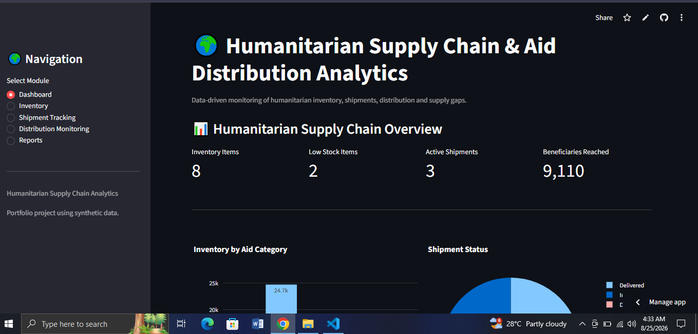

# Humanitarian Supply Chain & Aid Distribution Analytics

A Streamlit-based humanitarian logistics and aid distribution analytics system designed to monitor relief inventory, shipments, distribution activities, supply gaps, and beneficiary reach.

## 🚀 Live Demo

[Open Live Demo](https://humanitarian-supply-chain-analytics.streamlit.app/)

## 📂 GitHub Repository

[View Source Code](https://github.com/mdisrak21/humanitarian-supply-chain-analytics)

## 📊 Dashboard Preview



## 🎯 Project Objectives

* Monitor humanitarian aid inventory
* Identify low-stock and supply-gap items
* Track humanitarian shipments
* Monitor aid distribution activities
* Analyze beneficiaries and households reached
* Compare humanitarian performance across districts
* Generate downloadable operational reports

## ✨ Key Features

### 📦 Inventory Management

* Aid item tracking
* Warehouse-level inventory monitoring
* Minimum stock threshold monitoring
* Low-stock identification
* Supply gap calculation

### 🚚 Shipment Tracking

* Shipment registration
* Origin and destination tracking
* Dispatch and expected delivery dates
* Shipment status monitoring
* Delivered and in-transit shipment analysis

### 📍 Distribution Monitoring

* District-level distribution records
* Distribution center monitoring
* Household reach tracking
* Beneficiary reach tracking
* Distributed quantity analysis

### ⚠️ Supply Gap Detection

The system automatically identifies items where the current stock falls below the defined minimum stock level.

This helps highlight potential shortages that may require replenishment or operational attention.

### 📊 Analytics Dashboard

The dashboard provides an overview of:

* Inventory levels
* Low-stock items
* Active shipments
* Shipment status
* Beneficiaries reached
* Distribution performance
* District-level humanitarian activities

### 📑 Reporting

Users can view operational reports and download them as CSV files for further analysis and documentation.

## 🛠️ Technology Stack

* **Python**
* **Streamlit**
* **Pandas**
* **Plotly**
* **SQLite**

## 🗂️ Project Structure

```text
humanitarian-supply-chain-analytics/
│
├── app.py
├── database.py
├── requirements.txt
├── dashboard.PNG
├── README.md
├── .gitignore
└── humanitarian_supply_chain.db
```

## ▶️ Run Locally

### 1. Clone the repository

```bash
git clone https://github.com/mdisrak21/humanitarian-supply-chain-analytics.git
```

### 2. Navigate to the project directory

```bash
cd humanitarian-supply-chain-analytics
```

### 3. Create a virtual environment

```bash
python -m venv venv
```

### 4. Activate the virtual environment on Windows

```powershell
.\venv\Scripts\Activate.ps1
```

### 5. Install dependencies

```bash
pip install -r requirements.txt
```

### 6. Run the application

```bash
streamlit run app.py
```

The application will open in your browser.

## 📌 Data

This project uses **synthetic humanitarian operational data** for demonstration and portfolio purposes.

It does not contain real beneficiary information, personally identifiable information, or confidential humanitarian data.

## 🌍 Humanitarian Relevance

Humanitarian organizations operate complex systems involving inventory, logistics, distribution, and beneficiary support.

This project demonstrates how data analytics can help improve operational visibility by connecting:

**Inventory → Shipments → Distribution → Beneficiaries → Supply Gaps**

The system can support decision-making around:

* Relief stock monitoring
* Shipment tracking
* Distribution planning
* Supply shortage identification
* District-level performance monitoring
* Operational reporting

## 🎓 Skills Demonstrated

* Python application development
* Streamlit dashboard development
* SQLite database design
* CRUD-style data management
* Data analysis with Pandas
* Interactive visualization with Plotly
* Humanitarian logistics analytics
* Supply gap monitoring
* Operational reporting
* Data-driven decision support

## 🔐 Privacy & Security

This project is designed for demonstration purposes using synthetic data.

No real beneficiary records or sensitive personal information are included.

## 👤 Author

**Md Israk**

GitHub:
https://github.com/mdisrak21

## 📄 License

This project is intended for educational, portfolio, and demonstration purposes.

---

Built as a portfolio project focused on humanitarian data analytics, supply chain monitoring, operational visibility, and decision support.
